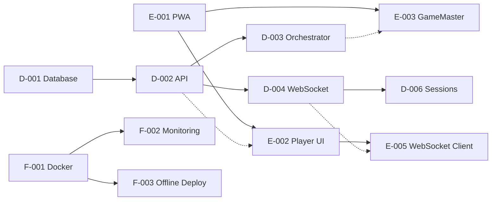

# Phase 1 Implementation Tickets

**Generated:** 2025-09-19
**Source:** Architecture RFC v1.0 and Integration Contracts
**Agent C Sign-off:** ✅ Complete

---

## 🎯 Agent D — Backend Development

### Ticket D-001: Database Setup & Migrations
**Priority:** P0 - Critical
**Size:** L
**Dependencies:** None
**RFC References:** Section 5 (Data Model), `/db/prisma/schema.prisma`

**Acceptance Criteria:**
- [ ] Initialize PostgreSQL with connection pooling (max 200 connections)
- [ ] Configure Prisma with schema from `/db/prisma/schema.prisma`
- [ ] Run initial migrations creating all 13 tables
- [ ] Create indexes as specified (game PIN, player composite, claims timestamp)
- [ ] Seed database with test data for development
- [ ] Verify ACID compliance for critical operations

**Technical Notes:**
- Use Prisma CLI for migration management
- Implement optimistic locking on Game and Claim models
- Configure read replicas for future scaling

---

### Ticket D-002: REST API Core Implementation
**Priority:** P0 - Critical
**Size:** XL
**Dependencies:** D-001
**RFC References:** Section 3 (API Layer), `/contracts/openapi/bingo.yaml`
**OpenAPI Path Coverage:** `/games`, `/games/{id}/open`, `/games/{id}/start`, `/games/{id}/pause`, `/games/{id}/resume`, `/games/{id}/draw`, `/games/{id}/auto-draw`, `/games/{pin}/join`, `/games/{id}/players/{playerId}/resume`, `/games/{id}/players/{playerId}/mark`, `/games/{id}/players/{playerId}/claim`, `/games/{id}/players/{playerId}/penalty`, `/games/{id}/snapshot`

**Acceptance Criteria:**
- [ ] Implement all 25+ REST endpoints from OpenAPI spec
- [ ] JWT authentication middleware with HS256 signing
- [ ] Role-based access control (player, gamemaster, admin)
- [ ] Request validation against OpenAPI schemas
- [ ] Idempotency key handling for critical operations
- [ ] Error responses matching specification

**Technical Notes:**
- Use Fastify with OpenAPI plugin for auto-validation
- Implement correlation IDs for request tracking
- Add request/response logging middleware

---

### Ticket D-003: Game Orchestrator Library
**Priority:** P0 - Critical
**Size:** XL
**Dependencies:** D-001, D-002
**RFC References:** Section 3 (Orchestrator), Section 6 (Security)

**Acceptance Criteria:**
- [ ] Implement orchestrator as embedded Node.js library
- [ ] HMAC-SHA256 RNG seeding with game-specific salt
- [ ] Card generation with 5x5 grid and HMAC signatures
- [ ] Draw sequence management with cryptographic integrity
- [ ] Claim validation with microsecond timestamp precision
- [ ] Pattern matching for all 14 Bingo patterns
- [ ] Penalty engine with 3-strike system

**Technical Notes:**
- Use crypto.createHmac for deterministic RNG
- Implement factory pattern for card generation
- Cache generated cards in Redis for performance
- Orchestrator touchpoints shared with Agent E for realtime event parity

---

### Ticket D-004: WebSocket Server Implementation
**Priority:** P0 - Critical
**Size:** L
**Dependencies:** D-002
**RFC References:** Section 3 (Realtime), `/contracts/sockets/events.md`

**Acceptance Criteria:**
- [ ] Socket.IO server with Redis adapter
- [ ] Namespace configuration (/game, /admin, /system)
- [ ] JWT handshake validation
- [ ] Room management for game isolation
- [ ] Event handlers for all 30+ event types
- [ ] Event acknowledgment for critical operations

**Performance Requirements:**
- Draw broadcast <200ms to 1000 clients
- Event fanout <50ms
- Reconnection <3 seconds

---

### Ticket D-005: Rate Limiting & Security
**Priority:** P1 - High
**Size:** M
**Dependencies:** D-002, D-004
**RFC References:** Section 6 (Security), `/architecture/security/fairness-and-security.md`

**Acceptance Criteria:**
- [ ] Token bucket rate limiting with Redis
- [ ] Limits: 15 marks/10s, 5 claims/min per player
- [ ] Exponential backoff for violations
- [ ] IP-based connection limits (5 per game)
- [ ] Audit logging with hash chain integrity
- [ ] Suspicious activity detection

**Technical Notes:**
- Use Redis INCR with TTL for token buckets
- Implement circuit breaker pattern for abuse
- Log all security events to audit_log table

---

### Ticket D-006: Session Management & Resume
**Priority:** P1 - High
**Size:** M
**Dependencies:** D-004
**RFC References:** Section 7 (Reliability), Section 4 (Reconnection)

**Acceptance Criteria:**
- [ ] JWT resume tokens with 30-minute expiry
- [ ] Redis-based session storage
- [ ] Event replay for missed draws
- [ ] State synchronization on reconnect
- [ ] Cross-instance session sharing
- [ ] Graceful degradation without Redis

---

## 🎨 Agent E — Frontend Development (React + Vite)

### Ticket E-001: PWA Foundation & Service Worker
**Priority:** P0 - Critical
**Size:** L
**Dependencies:** None
**RFC References:** Section 9 (Offline), `/architecture/offline/offline-mode.md`

**Acceptance Criteria:**
- [ ] PWA manifest with install prompts
- [ ] Service Worker with cache-first strategy
- [ ] Offline queue for mutations
- [ ] Background sync for queued operations
- [ ] Update notifications for new versions
- [ ] mDNS service discovery for LAN mode

**Technical Notes:**
- Scaffold monorepo frontends with React 18 + Vite, Tailwind, and shadcn/ui components
- Use Workbox for service worker management
- Implement IndexedDB for offline storage
- Cache static assets aggressively

---

### Ticket E-002: Player Game Interface
**Priority:** P0 - Critical
**Size:** XL
**Dependencies:** E-001
**RFC References:** UI wireframes, `/contracts/sockets/events.md`

**Acceptance Criteria:**
- [ ] PIN entry screen with validation
- [ ] 5x5 Bingo card display with marking
- [ ] Real-time draw updates via WebSocket
- [ ] Number marking with optimistic updates
- [ ] Claim button with pattern selection
- [ ] Strike/penalty notifications
- [ ] Winner celebration animations

**Performance Requirements:**
- Draw update render <50ms
- Touch response <100ms
- 60fps animations

---

### Ticket E-003: GameMaster Console
**Priority:** P0 - Critical
**Size:** XL
**Dependencies:** E-001
**RFC References:** Admin namespace, `/contracts/sockets/events.md`

**Acceptance Criteria:**
- [ ] Game creation with configuration
- [ ] Manual/auto draw controls
- [ ] Real-time player list with status
- [ ] Claims queue with validation details
- [ ] Penalty management interface
- [ ] Game statistics dashboard
- [ ] Emergency controls (pause, cancel)

**Technical Notes:**
- Compose UI using React component architecture aligned to design specs
- Implement keyboard shortcuts for draws
- Add confirmation dialogs for destructive actions
- Support multiple browser tabs

---

### Ticket E-004: Big-Screen Display Component
**Priority:** P1 - High
**Size:** M
**Dependencies:** E-001
**RFC References:** Display events, `/contracts/sockets/events.md`

**Acceptance Criteria:**
- [ ] Full-screen display mode
- [ ] Live draw history with animations
- [ ] Current number spotlight
- [ ] Player count and statistics
- [ ] Winner announcements
- [ ] Configurable themes
- [ ] Auto-scaling for different screen sizes

**Technical Notes:**
- Implement as React full-screen scene with Vite code-splitting for media-heavy assets
- Reuse motion variants from `apps/_design-tokens/motion.variants.ts`

---

### Ticket E-005: WebSocket Integration & State Sync
**Priority:** P0 - Critical
**Size:** L
**Dependencies:** E-002, E-003, E-004
**RFC References:** Section 4 (Sequences), `/contracts/sockets/events.md`

**Acceptance Criteria:**
- [ ] Socket.IO client with auto-reconnect
- [ ] JWT authentication flow
- [ ] Namespace/room management
- [ ] Event handler registration
- [ ] State reconciliation on reconnect
- [ ] Optimistic update rollback
- [ ] Connection status indicators

**Performance Requirements:**
- Reconnection <3 seconds
- State sync <500ms
- No dropped events

**Technical Notes:**
- Centralize Socket.IO hooks using React context/provider pattern
- Ensure hydration-safe usage for SSR/static exports

---

### Ticket E-006: Responsive & Accessibility
**Priority:** P1 - High
**Size:** M
**Dependencies:** E-002, E-003, E-004
**RFC References:** PWA requirements

**Acceptance Criteria:**
- [ ] Mobile-first responsive design
- [ ] Touch gesture support
- [ ] Landscape/portrait optimization
- [ ] WCAG 2.1 AA compliance
- [ ] Screen reader support
- [ ] High contrast mode
- [ ] Keyboard navigation

**Technical Notes:**
- Use Tailwind responsive utilities and Radix primitives from shadcn/ui
- Validate contrast and motion preferences via React testing library

---

## 🔧 Agent F — DevOps & Infrastructure

### Ticket F-001: Docker Configuration
**Priority:** P0 - Critical
**Size:** L
**Dependencies:** None
**RFC References:** Section 9 (Offline), `/architecture/offline/offline-mode.md`

**Acceptance Criteria:**
- [ ] Multi-stage Dockerfiles for all services
- [ ] Docker Compose configuration
- [ ] Health checks for all containers
- [ ] Volume mounts for persistence
- [ ] Environment variable management
- [ ] Build optimization (<5 minute builds)

**Technical Notes:**
- Use Alpine base images for size
- Implement layer caching strategies
- Add docker-compose.override for development

---

### Ticket F-002: Monitoring Stack Setup
**Priority:** P1 - High
**Size:** L
**Dependencies:** F-001
**RFC References:** Section 8 (Observability), `/architecture/observability/`

**Acceptance Criteria:**
- [ ] Prometheus metrics collection
- [ ] Grafana with 5 dashboards from specs
- [ ] OpenTelemetry instrumentation
- [ ] Log aggregation with Loki
- [ ] Alert rules configuration
- [ ] Custom metrics for game KPIs

**Dashboards Required:**
1. Real-time Operations
2. Performance Analytics
3. Business Intelligence
4. Security Monitoring
5. Infrastructure Health

---

### Ticket F-003: Offline Deployment Pipeline
**Priority:** P0 - Critical
**Size:** M
**Dependencies:** F-001
**RFC References:** Section 9 (Offline), `/architecture/offline/offline-mode.md`

**Acceptance Criteria:**
- [ ] One-command deployment script
- [ ] mDNS service configuration
- [ ] Asset bundling pipeline
- [ ] Network configuration automation
- [ ] Deployment validation checks
- [ ] Rollback capability

**Technical Notes:**
- Use Avahi for mDNS on Linux
- Bundle all assets for offline operation
- Include deployment troubleshooting guide

---

### Ticket F-004: Load Testing Infrastructure
**Priority:** P1 - High
**Size:** M
**Dependencies:** F-001, F-002
**RFC References:** Section 10 (Performance Targets)

**Acceptance Criteria:**
- [ ] K6 load test scripts
- [ ] 1200 concurrent player simulation
- [ ] WebSocket connection testing
- [ ] Draw latency measurements
- [ ] Claim validation performance
- [ ] Results dashboard in Grafana

**Performance Validation:**
- Draw → UI: <200ms average, <300ms P95
- Claim validation: <100ms
- Player join: <500ms
- Error rate: <1% at capacity

---

### Ticket F-005: CI/CD Pipeline
**Priority:** P2 - Medium
**Size:** M
**Dependencies:** F-001, F-004
**RFC References:** Development workflow

**Acceptance Criteria:**
- [ ] GitHub Actions workflow
- [ ] Automated testing on PR
- [ ] Docker image building
- [ ] Version tagging strategy
- [ ] Deployment to staging
- [ ] Performance regression tests

---

### Ticket F-006: Security Hardening
**Priority:** P1 - High
**Size:** M
**Dependencies:** F-001, F-002
**RFC References:** Section 6 (Security), `/architecture/security/`

**Acceptance Criteria:**
- [ ] Container security scanning
- [ ] Network policies configuration
- [ ] Secrets management (no hardcoded)
- [ ] TLS/SSL for production
- [ ] Security headers configuration
- [ ] Rate limiting at ingress

---

## 📊 Sprint Planning Recommendation

### Sprint 1 (Weeks 1-2) - Foundation
- D-001: Database Setup
- E-001: PWA Foundation
- F-001: Docker Configuration
- D-002: REST API Core (start)

### Sprint 2 (Weeks 3-4) - Core Game Logic
- D-002: REST API Core (complete)
- D-003: Game Orchestrator
- E-002: Player Interface (start)
- F-003: Offline Deployment

### Sprint 3 (Weeks 5-6) - Real-time & UI
- D-004: WebSocket Server
- E-002: Player Interface (complete)
- E-003: GameMaster Console
- F-002: Monitoring Stack

### Sprint 4 (Weeks 7-8) - Polish & Performance
- D-005: Rate Limiting
- D-006: Session Management
- E-004: Big-Screen Display
- E-005: WebSocket Integration
- F-004: Load Testing

### Sprint 5 (Week 9) - Finalization
- E-006: Accessibility
- F-005: CI/CD Pipeline
- F-006: Security Hardening
- Integration testing
- Performance validation

---

## 🔗 Cross-Agent Dependencies

---

## ✅ Definition of Done

Each ticket is considered complete when:
1. Code implemented and passing tests
2. Performance targets met
3. Security requirements validated
4. Documentation updated
5. Integration tests passing
6. Code reviewed and approved
7. Deployed to staging environment

---

## 📋 Existing PRD User Stories

The following user stories from the PRD should be incorporated into the implementation:

# US-PL-001 — Player joins by PIN

## Scope
- Traceability: `docs/prd/acceptance_criteria_matrix.csv:2`
- PRD section: `docs/prd/PRD_v1.0.md:13`
- Labels: frontend/*, backend/*, qa, security, devops, docs

## Acceptance Snapshot
- Given: Given an active game PIN and available slot
- When: When the player submits PIN + unique nickname
- Then: Then the server validates credentials, issues signed card + JWT, or returns specific error
- Perf target: <200ms server p95
- Notes: Errors include invalid PIN, game closed, name collision

---

# US-PL-002 — Player marks/undoes called number

## Scope
- Traceability: `docs/prd/acceptance_criteria_matrix.csv:3`
- PRD section: `docs/prd/PRD_v1.0.md:37`
- Labels: frontend/*, backend/*, qa, security, devops, docs

## Acceptance Snapshot
- Given: Given number X appears on the card and has been drawn
- When: When the player taps the cell
- Then: Then the cell toggles marked state with visual confirmation and server ack
- Perf target: <120ms round-trip, <16ms frame render
- Notes: Server rejects undrawn numbers with toast

---

# US-PL-003 — Player claims Bingo (valid)

## Scope
- Traceability: `docs/prd/acceptance_criteria_matrix.csv:4`
- PRD section: `docs/prd/PRD_v1.0.md:21`
- Labels: frontend/*, backend/*, qa, security, devops, docs

## Acceptance Snapshot
- Given: Given the player has a complete winning pattern
- When: When Claim Bingo is pressed
- Then: Then the server validates pattern, records winner, and broadcasts results
- Perf target: <300ms end-to-end
- Notes: Sets game state to WON when single-winner

---

# US-PL-004 — Player claims Bingo (invalid)

## Scope
- Traceability: `docs/prd/acceptance_criteria_matrix.csv:5`
- PRD section: `docs/prd/PRD_v1.0.md:27`
- Labels: frontend/*, backend/*, qa, security, devops, docs

## Acceptance Snapshot
- Given: Given the pattern is incomplete
- When: When Claim Bingo is pressed
- Then: Then the server denies claim, applies +1 strike, triggers 30s cooldown
- Perf target: <150ms denial response
- Notes: Cooldown timer visible to player and GM

---

# US-PL-005 — Player resumes after reload

## Scope
- Traceability: `docs/prd/acceptance_criteria_matrix.csv:6`
- PRD section: `docs/prd/PRD_v1.0.md:35`
- Labels: frontend/*, backend/*, qa, security, devops, docs

## Acceptance Snapshot
- Given: Given a valid resume token
- When: When the player reloads within session window
- Then: Then the client restores board, replays missed draws, and resumes socket
- Perf target: Reconnect ≤3s on LAN
- Notes: New token issued and resume_success logged

---

# US-GM-000 — GameMaster creates lobby

## Scope
- Traceability: `docs/prd/acceptance_criteria_matrix.csv:7`
- PRD section: `docs/prd/PRD_v1.0.md:32`
- Labels: frontend/*, backend/*, qa, security, devops, docs

## Acceptance Snapshot
- Given: Given GM is authenticated
- When: When GM configures settings and presses Create
- Then: Then system persists game, generates PIN, and opens lobby
- Perf target: <500ms API p95
- Notes: Settings stored with HMAC checksum

---

# US-GM-003 — GameMaster start/pause/resume

## Scope
- Traceability: `docs/prd/acceptance_criteria_matrix.csv:8`
- PRD section: `docs/prd/PRD_v1.0.md:37`
- Labels: frontend/*, backend/*, qa, security, devops, docs

## Acceptance Snapshot
- Given: Given lobby has ≥1 player
- When: When GM presses Start, Pause, or Resume
- Then: Then game state updates and broadcasts to clients
- Perf target: <200ms propagation
- Notes: Pause halts auto-draw timer without extra draw

---

# US-GM-001 — GameMaster draws number

## Scope
- Traceability: `docs/prd/acceptance_criteria_matrix.csv:9`
- PRD section: `docs/prd/PRD_v1.0.md:37`
- Labels: frontend/*, backend/*, qa, security, devops, docs

## Acceptance Snapshot
- Given: Given game state=RUNNING and balls remain
- When: When GM triggers manual draw
- Then: Then next number persists, LEDGER signs it, and clients update
- Perf target: <200ms publish→receive
- Notes: History panel updates across all clients

---

# US-GM-002 — Auto-draw interval

## Scope
- Traceability: `docs/prd/acceptance_criteria_matrix.csv:10`
- PRD section: `docs/prd/PRD_v1.0.md:37`
- Labels: frontend/*, backend/*, qa, security, devops, docs

## Acceptance Snapshot
- Given: Given auto-draw toggled on
- When: When GM sets interval N (5–20s) and enables
- Then: Then numbers draw on schedule honoring pause/resume
- Perf target: ±100ms jitter around target interval
- Notes: Timer stops during GM media cues

---

# US-GM-004 — Manage claims & strikes

## Scope
- Traceability: `docs/prd/acceptance_criteria_matrix.csv:11`
- PRD section: `docs/prd/PRD_v1.0.md:27`
- Labels: frontend/*, backend/*, qa, security, devops, docs

## Acceptance Snapshot
- Given: Given one or more pending claims
- When: When GM accepts or denies a claim
- Then: Then winner state updates, strikes adjust, and notifications emit
- Perf target: <250ms resolution
- Notes: Audit log includes GM ID and action

---

# US-GM-005 — Penalty disqualification

## Scope
- Traceability: `docs/prd/acceptance_criteria_matrix.csv:12`
- PRD section: `docs/prd/PRD_v1.0.md:27`
- Labels: frontend/*, backend/*, qa, security, devops, docs

## Acceptance Snapshot
- Given: Given a player reaches 3 strikes
- When: When threshold is met or GM enforces disqualification
- Then: Then claim button disables, banner displays reason, and GM can reinstate
- Perf target: UI update <150ms
- Notes: Disqualified player excluded from winner prompts

---

# US-SC-001 — Big-Screen updates draws

## Scope
- Traceability: `docs/prd/acceptance_criteria_matrix.csv:13`
- PRD section: `docs/prd/PRD_v1.0.md:38`
- Labels: frontend/*, backend/*, qa, security, devops, docs

## Acceptance Snapshot
- Given: Given a new draw event
- When: When Big-Screen receives broadcast
- Then: Then current number animates, history shifts, and media cues sync
- Perf target: 60fps animation with <50ms animation start delay
- Notes: No dropped frames in 5-minute soak

---

# US-NET-001 — Offline discovery (LAN)

## Scope
- Traceability: `docs/prd/acceptance_criteria_matrix.csv:14`
- PRD section: `docs/prd/PRD_v1.0.md:34`
- Labels: frontend/*, backend/*, qa, security, devops, docs

## Acceptance Snapshot
- Given: Given GameMaster advertises bingo.local via mDNS
- When: When Player app scans network
- Then: Then endpoint resolves and connects without manual IP
- Perf target: Discovery <2s on LAN
- Notes: Fallback manual entry logged

---

# US-ARCH-001 — Server-authoritative validation

## Scope
- Traceability: `docs/prd/acceptance_criteria_matrix.csv:15`
- PRD section: `docs/prd/PRD_v1.0.md:32`
- Labels: frontend/*, backend/*, qa, security, devops, docs

## Acceptance Snapshot
- Given: Given mark/claim payloads arrive
- When: When server processes them
- Then: Then only signed, valid state persists and tampered payloads rejected
- Perf target: <100ms validation p95
- Notes: WARN log + metric on rejection

---

# US-SEC-001 — Rate limit claims

## Scope
- Traceability: `docs/prd/acceptance_criteria_matrix.csv:16`
- PRD section: `docs/prd/PRD_v1.0.md:44`
- Labels: frontend/*, backend/*, qa, security, devops, docs

## Acceptance Snapshot
- Given: Given a player exceeds 5 claims/min
- When: When next claim is attempted
- Then: Then system blocks action, issues strike, and logs rate limit
- Perf target: Block response <120ms
- Notes: Metric `claims_rate_limited` increments

---

# US-OPS-001 — Observability baseline

## Scope
- Traceability: `docs/prd/acceptance_criteria_matrix.csv:17`
- PRD section: `docs/prd/PRD_v1.0.md:45`
- Labels: frontend/*, backend/*, qa, security, devops, docs

## Acceptance Snapshot
- Given: Given services are running
- When: When join/draw/claim flows occur
- Then: Then traces, metrics, and logs appear in Grafana/OTel dashboards
- Perf target: Telemetry ingest <60s
- Notes: Dashboard IDs documented in runbook

---

# US-PWA-001 — PWA install & offline resume

## Scope
- Traceability: `docs/prd/acceptance_criteria_matrix.csv:18`
- PRD section: `docs/prd/PRD_v1.0.md:46`
- Labels: frontend/*, backend/*, qa, security, devops, docs

## Acceptance Snapshot
- Given: Given user meets install criteria
- When: When PWA prompt fires
- Then: Then install prompt displays and service worker caches core assets
- Perf target: Precache <2s on reference device
- Notes: Offline splash passes Lighthouse offline test

---

# US-SCL-001 — Scale soak test

## Scope
- Traceability: `docs/prd/acceptance_criteria_matrix.csv:19`
- PRD section: `docs/prd/PRD_v1.0.md:42`
- Labels: frontend/*, backend/*, qa, security, devops, docs

## Acceptance Snapshot
- Given: Given load rig simulates 1000 concurrent players
- When: When 15-minute soak runs
- Then: Then average draw latency stays <200ms, error rate <1%
- Perf target: Latency <200ms avg; error rate <1%
- Notes: Report exported to Prometheus + shared drive

---

# US-AUD-001 — Signed draw ledger integrity

## Scope
- Traceability: `docs/prd/acceptance_criteria_matrix.csv:20`
- PRD section: `docs/prd/PRD_v1.0.md:44`
- Labels: frontend/*, backend/*, qa, security, devops, docs

## Acceptance Snapshot
- Given: Given draws are persisted
- When: When auditor reviews ledger
- Then: Then each entry has HMAC signature verifiable with shared secret
- Perf target: Verification <50ms per entry
- Notes: Mismatch raises critical alert

---

**Agent C — System Architect**
**Status:** Phase 1 Tickets Generated
**Date:** 2025-09-19
